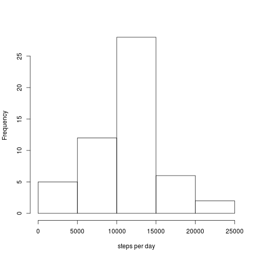
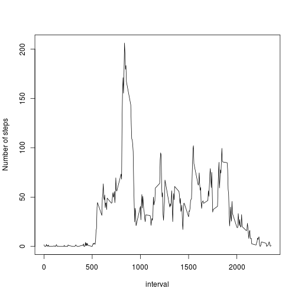
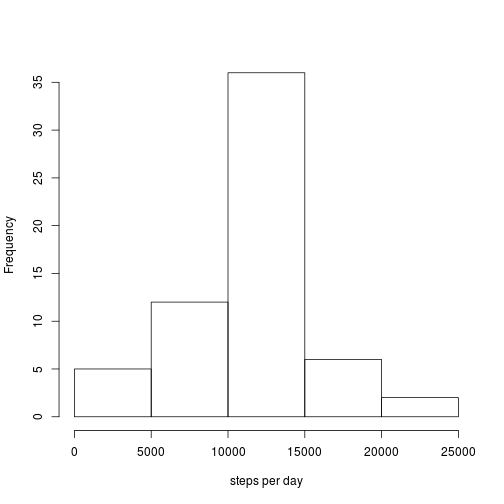
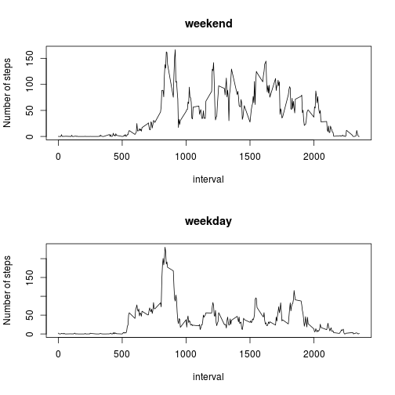

## Loading and preprocessing the data

Loading data and converting date string to Date object:

```r
data <- read.csv(unz('activity.zip', 'activity.csv'))
data$date <- as.Date(data$date)
```

## What is mean total number of steps taken per day?

The total number of steps taken per day:

```r
steps_per_day <- aggregate(steps ~ date, data, sum)
hist(steps_per_day$steps, main='', xlab='steps per day')
```



The mean and median of the total number of steps per day:

```r
mean_steps_per_day <- mean(steps_per_day$steps)
mean_steps_per_day
```

```
## [1] 10766.19
```

```r
median_steps_per_day <- median(steps_per_day$steps)
median_steps_per_day
```

```
## [1] 10765
```

## What is the average daily activity pattern?


```r
avg_steps_per_interval <- aggregate(steps ~ interval, data, mean)
with(avg_steps_per_interval, {
    plot(interval, steps, main='', xlab='interval', ylab='Number of steps', type='l')
})
```



Interval that contains the maximum number of steps on average across all days:

```r
avg_steps_per_interval[which.max(avg_steps_per_interval$steps), c('interval')]
```

```
## [1] 835
```

## Inputing missing values

Total number of missing values in dataset:


```r
sum(complete.cases(data))
```

```
## [1] 15264
```

Filling missing data with average of steps across all days for that 5-minute interval:


```r
data_filled <- data

for(idx in which(is.na(data_filled$steps))) {
    data_filled[idx, c('steps')] <-
        avg_steps_per_interval[which(avg_steps_per_interval$interval == data_filled[idx, c('interval')]), c('steps')]
}
```

Distribution of steps per day in filled data:

```r
steps_per_day <- aggregate(steps ~ date, data_filled, sum)
hist(steps_per_day$steps, main='', xlab='steps per day')
```



The mean and median of steps per day in filled data:

```r
mean_steps_per_day <- mean(steps_per_day$steps)
mean_steps_per_day
```

```
## [1] 10766.19
```

```r
median_steps_per_day <- median(steps_per_day$steps)
median_steps_per_day
```

```
## [1] 10766.19
```

We observe that these values differ from the values without filling missing values. The mean and median are larger that the values obtained without filling missing values.


## Are there differences in activity patterns between weekdays and weekends?


```r
data_filled$day <- weekdays(as.Date(data_filled$date))
data_filled[data_filled$day %in% c("Saturday", "Sunday"), c('day')] <- "weekend"
data_filled[data_filled$day != "weekend", c('day')] <- "weekday"
```

Plots


```r
avg_steps_per_interval_and_day <- aggregate(cbind(steps) ~ interval + day, data_filled, mean)
par(mfrow=c(2, 1))
with(avg_steps_per_interval_and_day, {
    plot(interval[day=='weekend'], steps[day == 'weekend'], type='l', main='weekend', xlab='interval', ylab='Number of steps')
    plot(interval[day=='weekday'], steps[day == 'weekday'], type='l', main='weekday', xlab='interval', ylab='Number of steps')
})
```


